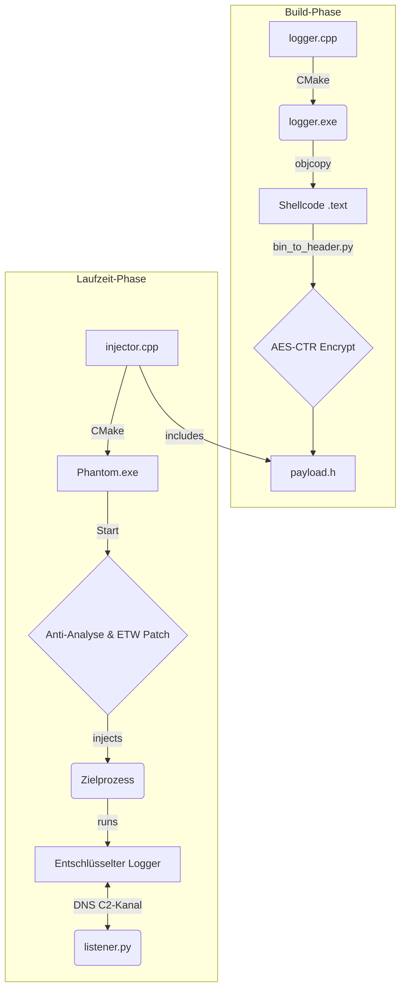

# Operation Phantom

**⚠️ Haftungsausschluss: Dieses Projekt dient ausschließlich zu Forschungs- und Bildungszwecken. Die Verwendung dieses Codes für unbefugte oder bösartige Aktivitäten ist strengstens untersagt. Die Autoren übernehmen keine Haftung für Missbrauch.**

---

## 1. Übersicht

**Operation Phantom** ist ein hochentwickeltes Framework für Red-Teaming-Operationen und die Malware-Forschung. Es demonstriert eine Reihe von fortschrittlichen Tarn- und Injektionstechniken, die darauf ausgelegt sind, moderne Sicherheitslösungen wie EDRs (Endpoint Detection and Response) und Antiviren-Software zu umgehen.

Das Projekt besteht aus zwei Hauptkomponenten: einem getarnten **Injector**, der für die Umgehung von Sicherheitsmaßnahmen und die Einschleusung des Payloads verantwortlich ist, und einem **Logger-Payload**, der sensible Daten sammelt und über einen verdeckten DNS-Kanal exfiltriert.

## 2. Kernfunktionen

*   **Polymorpher Build-Prozess:** Ein zweistufiger CMake-Build-Prozess, der den Payload (Logger) kompiliert, dessen Shellcode extrahiert, mit AES-CTR verschlüsselt und diesen dann als statische Ressource in den finalen Injector einbettet.
*   **Fortschrittliche Injektionstechniken:**
    *   Process Hollowing
    *   Early Bird APC Injection
    *   (Klassische) APC Injection
*   **Umgehung von API-Hooks (Userland):**
    *   **Direkte Syscalls:** Anstatt hochrangige WinAPI-Funktionen aufzurufen, werden Syscall-IDs zur Laufzeit dynamisch aus einer sauberen Kopie von `ntdll.dll` extrahiert und über eine separate Assembler-Routine (`syscall_stub.asm`) aufgerufen.
    *   **Unhooking:** Laden einer frischen Kopie von `ntdll.dll` aus der Festplatte, um EDR-Hooks im Speicher zu umgehen.
*   **In-Memory Evasion:**
    *   **ETW-Patching:** Überschreibt die `EtwEventWrite`-Funktion im Speicher, um das Event Tracing for Windows zu deaktivieren.
    *   **Anti-Analyse:** Enthält Prüfungen zur Erkennung von Debuggern, VMs (VMware, VirtualBox) und Sandboxes (Sandboxie).
*   **Verschlüsselung:**
    *   Der Shellcode-Payload wird zur Compile-Zeit mit **AES-CTR** verschlüsselt, um eine statische Analyse der finalen Binärdatei zu erschweren.
    *   Die Entschlüsselung findet erst im Speicher des Zielprozesses statt.
*   **Verdeckter C2-Kanal:**
    *   **DNS-Exfiltration:** Tastaturanschläge und Daten aus der Zwischenablage werden hex-kodiert und als Subdomains in DNS-Anfragen an einen vom Angreifer kontrollierten Server gesendet.
    *   **DNS-Commanding:** Der Payload kann über DNS-TXT-Records Befehle vom C2-Server empfangen (z.B. `SELF_DESTRUCT`).
*   **Dateilose Persistenz (File-less Persistence):**
    *   Implementiert eine fernsteuerbare Persistenzmethode über **WMI Event Subscription**. Der Payload wird in der Registry gespeichert und bei Benutzeranmeldung durch ein WMI-Ereignis ausgelöst.

## 3. Architektur

### 3.1. Komponenten

1.  **`injector.cpp`**: Der Haupt-Orchestrator. Führt Anti-Analyse-Prüfungen durch, lädt eine saubere `ntdll.dll`, initialisiert die Syscalls, wählt eine Injektionstechnik aus und schleust den Payload in einen Zielprozess (z.B. `svchost.exe`) ein.
2.  **`logger.cpp`**: Der Payload. Ein multithreaded Keylogger, der Tastatureingaben und die Zwischenablage überwacht, die Daten sammelt und über den DNS-C2-Kanal exfiltriert. Er kann auch Befehle vom C2-Server empfangen und ausführen.
3.  **`/techniques/`**: Ein Verzeichnis, das die verschiedenen, modularen Injektionstechniken enthält.
4.  **`syscalls.cpp` / `syscall_stub.asm`**: Das zentrale Modul für die dynamische Auflösung und Ausführung von direkten System Calls.
5.  **`bin_to_header.py`**: Ein Python-Skript, das den Build-Prozess steuert, indem es den Shellcode extrahiert, verschlüsselt und die resultierende `payload.h`-Datei generiert.
6.  **`listener.py`**: Der Python-basierte C2-Server, der auf DNS-Anfragen lauscht, die exfiltrierten Daten empfängt, entschlüsselt und speichert sowie Befehle an die Implants sendet.

### 3.2. Ablaufdiagramm



## 4. Build-Anleitung

### 4.1. Voraussetzungen

*   **CMake:** Version 3.15 oder höher.
*   **C++ Compiler:** Ein moderner Compiler mit C++17-Unterstützung (getestet mit MSVC in Visual Studio).
*   **NASM Assembler:** Muss im System-PATH verfügbar sein, damit CMake es finden kann. (`choco install nasm`)
*   **Python:** Version 3.x.
*   **Python-Bibliotheken:**
    ```
    pip install -r requirements.txt
    ```

### 4.2. Kompilierung

Das Projekt ist für einen Out-of-Source-Build konfiguriert.

1.  **Repository klonen:**
    ```bash
    git clone <repository_url>
    cd Operation-Phantom
    ```

2.  **Build-Verzeichnis erstellen:**
    ```bash
    mkdir build
    cd build
    ```

3.  **CMake ausführen, um das Projekt zu konfigurieren (Beispiel für Visual Studio 2022):**
    ```bash
    cmake .. -G "Visual Studio 17 2022" -A x64
    ```

4.  **Projekt bauen (Release-Konfiguration):**
    ```bash
    cmake --build . --config Release
    ```

Die fertige `Phantom.exe` befindet sich anschließend im Verzeichnis `build/Release/`.

## 5. Benutzung

1.  **C2-Listener konfigurieren und starten:**
    *   Passen Sie die `CONTROL_DOMAIN` und `IP_OF_THIS_SERVER` in `listener.py` an.
    *   Erzeugen Sie ein GPG-Schlüsselpaar und exportieren Sie den öffentlichen Schlüssel nach `public.key`.
    *   Starten Sie den Listener (benötigt Root-/Admin-Rechte für Port 53):
        ```bash
        sudo python3 listener.py
        ```

2.  **Injector ausführen:**
    *   Übertragen Sie die `Phantom.exe` auf das Zielsystem.
    *   Führen Sie die `Phantom.exe` aus. Der Injektor wird versuchen, den Payload in einen neu erstellten, unter `explorer.exe` hängenden `svchost.exe`-Prozess zu injizieren.

3.  **Daten und Befehle:**
    *   Exfiltrierte Daten erscheinen verschlüsselt in `exfiltrated_data.log.gpg`.
    *   Schreiben Sie Befehle (z.B. `CMD:SELF_DESTRUCT`) in die `command.txt`-Datei, damit der Listener sie an das Implantat weitergibt. 